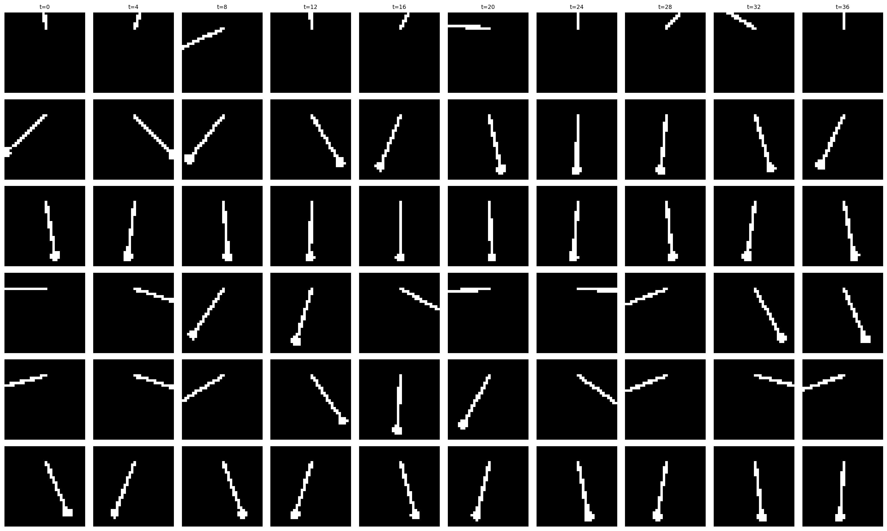

# More experiments in time dependent flows

A couple more iterations in, this varient defines a time dependent base distribution with a time dependent posterior and prior flow. 

Seems like a likely candidate for time dependent vaes, the posterior flow helps a lot in particular. Replacing the decoder in this varient with a time dependent conditional flow seems to give really great temporal consistency without much work.


This formulation is as follows:

```
maximize_{θ, φ}  E_{q_φ(c | x)} [
    log p_θ(x | z, t)
  + log p_θ(y | t)
  + log |det J_{f_θ}(z; c, t)|
  + log p_θ(c | t)
  - log q_φ(c | x)
];
where
  z = enc_θ(x),
  y = f_θ(z; c, t),
  p_θ(x | z, t) = Bernoulli(σ(g_θ(z, t))).
```



```
@misc{algomancer2025,
  author = {@algomancer},
  title  = {Some Dumb Shit},
  year   = {2025}
}
```
